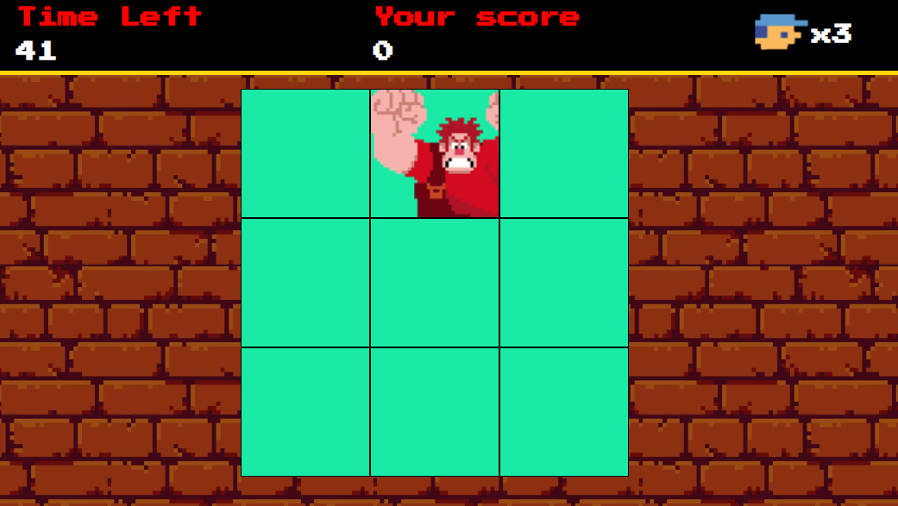

<h1 align="center">
  👊 JSGame: Detona Ralph 👾
</h1>

<p align="center">
  
</p>

<p align="center">
  <strong>Bem-vindo(a) ao mundo de 8 bits!</strong><br>
  Um jogo retrô inspirado no universo de <em>Detona Ralph</em> — direto do fliperama para o seu navegador!
</p>

---

## 🎮 Sobre o Jogo

O **JSGame: Detona Ralph** é uma experiência divertida criada com HTML, CSS e JavaScript que recria a vibe arcade dos anos 80! Derrube janelas, ganhe pontos e tente não perder o controle! 💥

---

## 🛠️ Tecnologias

Este jogo foi desenvolvido com:

- ⚙️ **HTML5 & CSS3**: Estrutura e estilo retrô.
- ⚡ **JavaScript**: Lógica de jogo, pontuação e interatividade.
- 🎨 **Sprites personalizados**: Fiel ao universo visual de _Detona Ralph_.

---

## 🚀 Funcionalidades

- 🕹️ **Clique nos quadrados onde Ralph aparece** para ganhar pontos.
- 🧠 Sistema de pontuação para testar seus reflexos!
- 📈 Interface simples e viciante — ideal para desafiar os amigos.

---

## ▶️ Como Jogar

1. Clone este repositório:
   ```bash
   git clone https://github.com/seu-usuario/jsgame-detona-ralph.git
   ```
2. Abra o arquivo `index.html` no seu navegador.
3. Ralph vai aparecer aleatoriamente nos quadrados. Clique nele para marcar pontos!
4. Tente alcançar a maior pontuação possível!

---

## 🤝 Contribua!

Quer deixar o jogo ainda mais radical? Sinta-se livre para:

- Criar novas fases 🧩
- Melhorar os gráficos 🎨
- Otimizar o código 🧠

Basta abrir um **Pull Request** ou relatar um bug via **Issues**!

---

## 👨‍💻 Créditos

Desenvolvido como parte de um projeto educacional da [Digital Innovation One](https://www.dio.me/).

---

<p align="center">
  🔗 <a href="https://github.com/digitalinnovationone/jsgame-detona-ralph">Confira o repositório original</a> <br>
  ⭐ Deixe sua estrela se curtir o projeto!
</p>
```
